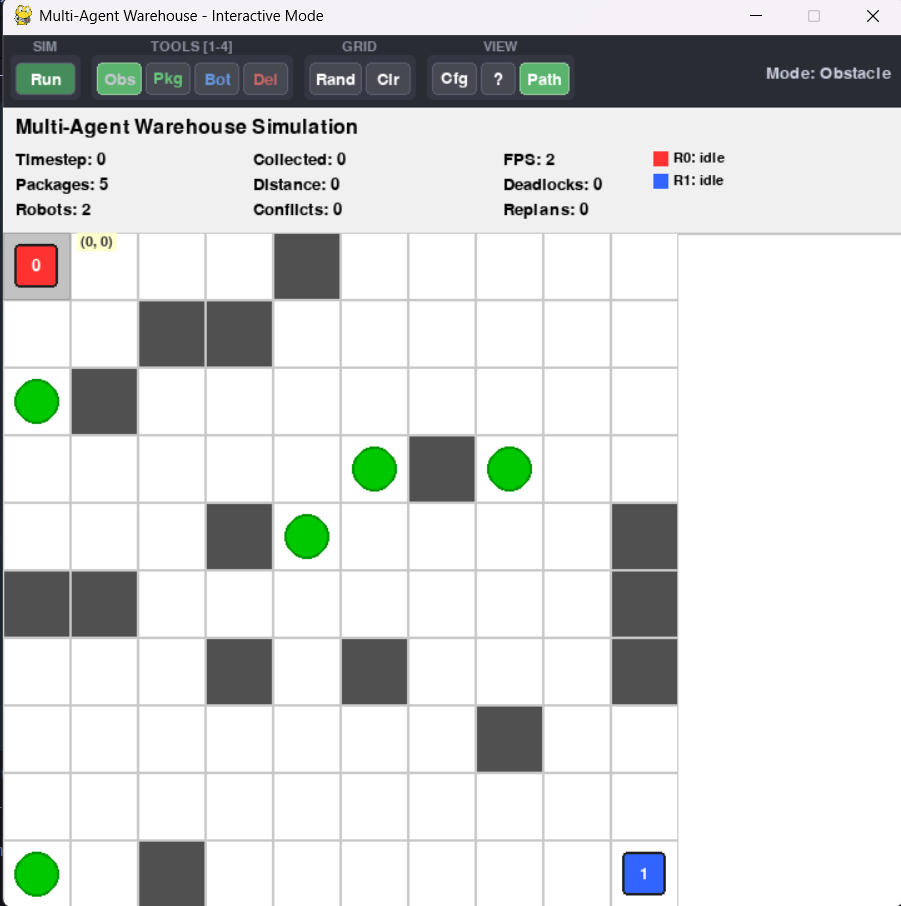
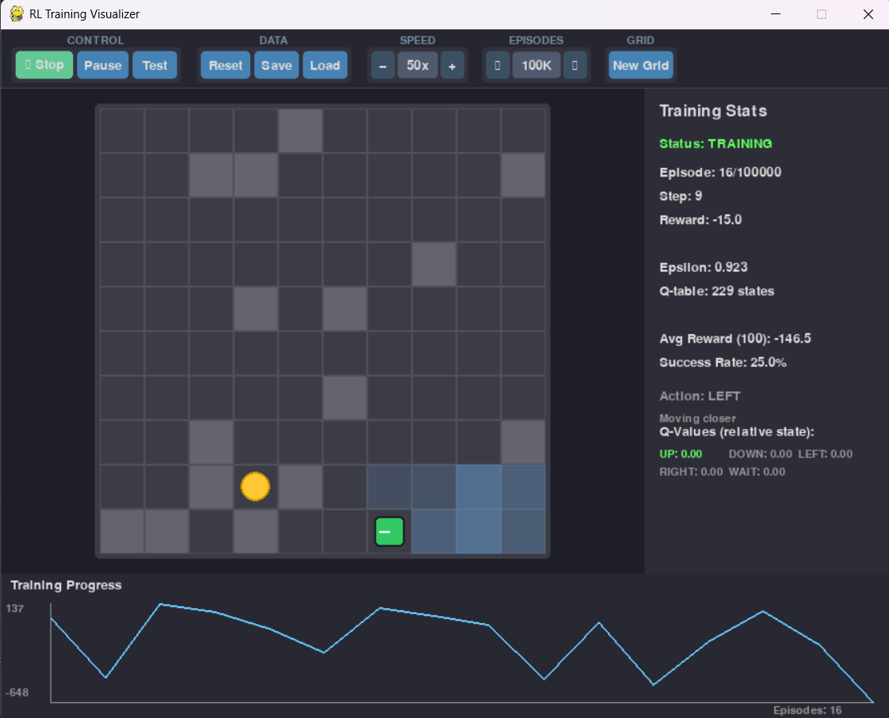
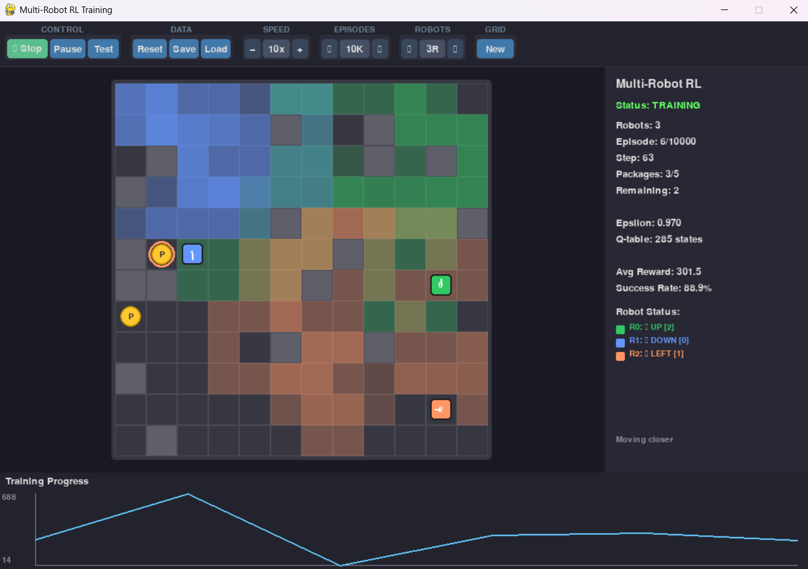
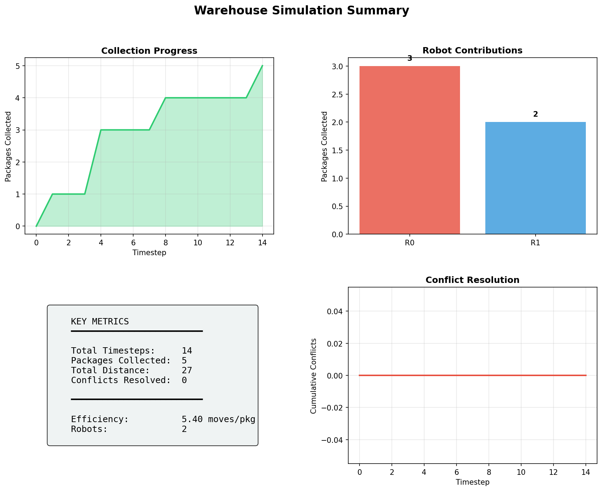
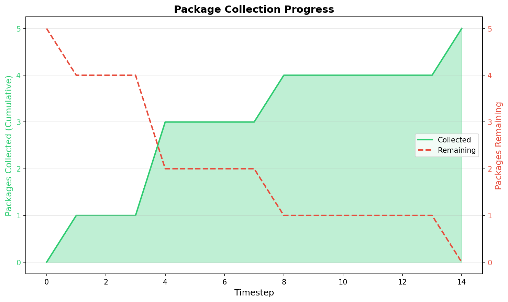
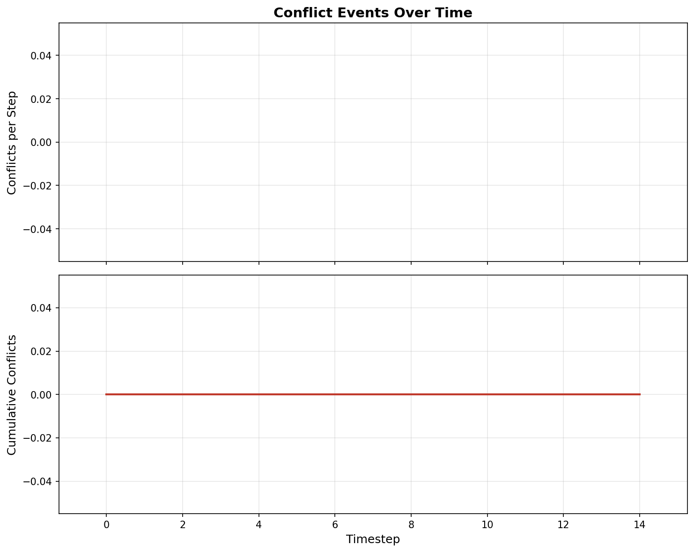
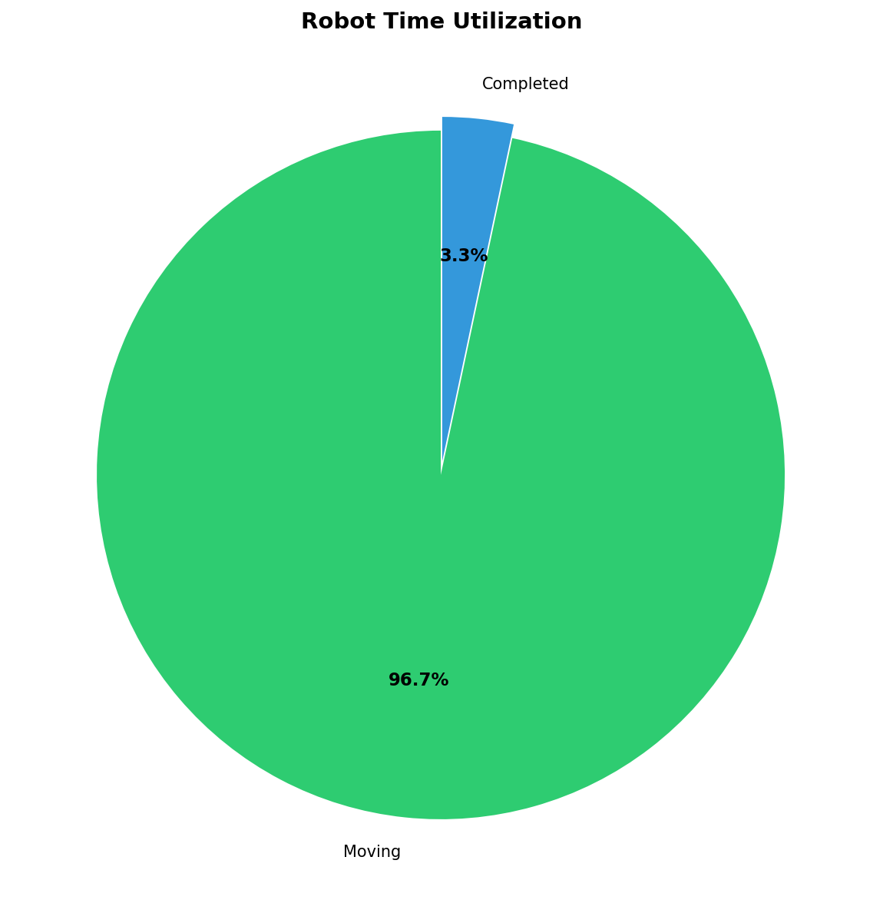

# Multi-Agent Robotic Warehouse System

A comprehensive grid-based multi-agent simulation system demonstrating autonomous robot coordination for package collection in a warehouse environment. This project implements classical AI algorithms (A* pathfinding) combined with modern reinforcement learning techniques (Q-Learning) to create intelligent, adaptive robot behavior.

## Team Members

- **Abdul Haseeb** (FA23-BCS-120) - abdlhaseeb17@gmail.com
- **Raja Ammar** (FA23-BCS-086) - rajammarahmd@gmail.com

**Course**: AI Lab (5th Semester)  
**Submitted to**: Ma'am Faiqa Rashid  
**Status**: Complete Implementation with RL Integration

---

## 🎯 Features

### Core AI Implementations

- **A* Pathfinding Algorithm**: Optimal navigation with Manhattan and Euclidean heuristics, robot-aware pathfinding
- **Multi-Agent Coordination**: Centralized manager handling task assignment, conflict resolution, and synchronization
- **Advanced Conflict Resolution**: 
  - Collision detection (same-cell and head-on)
  - Deadlock detection using dependency graph analysis
  - Priority-based resolution (distance to goal + packages collected)
  - Dynamic replanning when paths are blocked
- **Greedy Task Assignment**: Nearest-package-first with A* distance calculation
- **Robot-Aware Pathfinding**: A* considers other robot positions as temporary obstacles

### Reinforcement Learning Features

- **Q-Learning for Single Robot**: 
  - Relative state representation for grid-size independence
  - Oscillation detection and prevention
  - Stuck detection with forced exploration
  - Epsilon-greedy exploration with decay
- **Multi-Agent Q-Learning**: 
  - Independent Q-Learning (IQL) for coordinated learning
  - Shared package pool mode (any robot can collect any package)
  - Robot-robot collision avoidance in state space
  - Deadlock handling in multi-agent scenarios
- **RL Training Visualizers**: 
  - Single-robot RL training GUI with real-time progress
  - Multi-robot RL training GUI with shared packages
  - Configurable training episodes from GUI
  - Model saving and loading

### Uncertainty & Dynamic Adaptation

- **Probabilistic Obstacle Mapping**: Bayesian updates for uncertain obstacles
- **Sensor Simulation**: Noisy sensors with false positive/negative rates
- **Predictive Rerouting**: Risk-based path replanning when blockage detected
- **Dynamic Environment**: Support for changing obstacle configurations

### System Features

- Grid-based warehouse environment with obstacles
- Multiple autonomous robots operating concurrently
- Real-time package collection and tracking
- Comprehensive performance metrics and reporting
- Configurable simulation parameters
- Interactive Pygame GUI with drawing tools
- Text-based visualization mode
- Scalability testing framework

---

## 📸 Screenshots

### Main GUI - Interactive Simulation



The main GUI provides an interactive warehouse simulation where you can:
- Draw obstacles, place packages, and position robots
- Watch real-time simulation with path visualization
- View live statistics (packages collected, distance, conflicts, deadlocks, replans)
- Adjust simulation speed and grid size
- Toggle path display

### RL Training Visualizer - Single Robot



Train a Q-Learning agent with visual feedback:
- Real-time training progress
- Success rate tracking
- Episode counter
- Configurable training episodes
- Model save/load functionality

### Multi-Robot RL Training



Train multiple robots simultaneously:
- Shared package pool mode
- Individual robot statistics
- Package collection progress
- Coordinated learning visualization

---

## 📊 Performance Reports

The system generates comprehensive performance reports with visualizations:

### Dashboard Overview



Complete performance summary including:
- Total timesteps and packages collected
- Efficiency metrics (moves per package)
- Conflict and deadlock statistics
- Robot utilization breakdown

### Collection Timeline



Visual timeline showing:
- Package collection progress over time
- Per-robot collection rates
- Cumulative packages collected

### Conflict Analysis



Conflict patterns including:
- Conflicts per timestep
- Cumulative conflict count
- Peak conflict periods
- Conflict frequency analysis

### Robot Utilization



Robot activity breakdown:
- Moving vs idle percentages
- Waiting time analysis
- Active utilization metrics
- Status distribution

---

## 📁 Project Structure

```
multi-agent-robotic-warehouse-system/
├── warehouse/
│   ├── environment.py          # Grid environment and warehouse logic
│   ├── robot.py                # Robot behavior and state management
│   ├── pathfinding.py          # A* algorithm implementation
│   ├── coordination.py         # Multi-agent coordination manager
│   ├── uncertainty.py          # Probabilistic obstacles and sensors
│   └── rl_robot.py            # RL-integrated robot (optional)
├── rl/
│   ├── qlearning.py           # Single-agent Q-Learning
│   └── multi_agent_qlearning.py # Multi-agent Q-Learning
├── ui/
│   ├── text_ui.py             # Terminal-based visualization
│   ├── pygame_ui.py           # Main interactive GUI
│   ├── rl_gui.py              # Single-robot RL training GUI
│   └── multi_rl_gui.py        # Multi-robot RL training GUI
├── metrics/
│   ├── metrics.py             # Metrics collection
│   └── reporting.py           # Report generation with charts
├── experiments/
│   └── scalability.py         # Scalability testing framework
├── reports/                   # Generated performance reports
├── project-demo-images/      # Screenshots and demos
├── config.py                 # Configuration presets
├── main.py                   # Text simulation entry point
├── main_gui.py              # GUI simulation entry point
├── generate_documentation.py # DOCX documentation generator
├── test_basic.py            # Unit tests
└── requirements.txt         # Python dependencies
```

---

## 🚀 Installation

### Prerequisites

- Python 3.7 or higher
- pip package manager

### Setup

1. Clone or download the project repository

2. Install required dependencies:
```bash
pip install -r requirements.txt
```

**Core Dependencies:**
- `numpy>=1.21.0` - Grid data structures
- `pygame>=2.0.0` - Graphical visualization
- `matplotlib>=3.7.0` - Report generation (optional but recommended)

---

## 💻 Usage

### Running the Simulation

**Interactive GUI Mode (Recommended)**:
```bash
python main_gui.py
```

**Text-Based Mode (Terminal)**:
```bash
python main.py
```

**RL Training - Single Robot**:
```bash
python -c "from ui.rl_gui import RLTrainingUI; RLTrainingUI().run()"
```

**RL Training - Multi-Robot**:
```bash
python -c "from ui.multi_rl_gui import MultiRobotRLUI; MultiRobotRLUI().run()"
```

**Run Tests**:
```bash
python test_basic.py
```

**Generate Documentation**:
```bash
python generate_documentation.py
```

### Configuration

Edit `config.py` to customize simulation parameters:

```python
GRID_WIDTH = 10              # Warehouse width
GRID_HEIGHT = 10             # Warehouse height
OBSTACLE_DENSITY = 0.15      # Percentage of obstacles
NUM_PACKAGES = 5             # Number of packages
NUM_ROBOTS = 2               # Number of robots
MAX_TIMESTEPS = 500          # Maximum simulation steps

# RL Configuration
RL_ENABLED = True            # Enable RL features
RL_TRAINING_EPISODES = 1000  # Episodes for training
RL_USE_RELATIVE_STATE = True # Use relative state representation

# Metrics Configuration
METRICS_ENABLED = True       # Enable metrics collection
GENERATE_PLOTS = True        # Generate visualization reports
```

**Available Presets**:
- `config_small_test()`: 5×5 grid, 2 robots, 2 packages
- `config_medium()`: 10×10 grid, 2 robots, 5 packages (default)
- `config_large()`: 20×20 grid, 3 robots, 10 packages
- `config_stress()`: 30×30 grid, 3 robots, 15 packages
- `config_predefined_test()`: Pre-defined scenario for testing
- `config_uncertainty_demo()`: Enable uncertainty features
- `config_rl_training()`: Optimized for RL training

---

## 🎮 Controls (Pygame GUI)

### Simulation Controls
- **SPACE**: Start/Pause simulation
- **.** (period): Step once when paused
- **ESC**: Exit simulation

### Drawing Tools
- **1**: Obstacle mode (draw walls)
- **2**: Package mode (place packages)
- **3**: Robot mode (place robots)
- **4**: Erase mode (remove items)
- **C**: Clear entire grid
- **R**: Generate random warehouse
- **P**: Toggle path display

### Settings
- **S**: Open settings (grid size, FPS)
- **H**: Show/hide help
- **+/-**: Adjust simulation speed

### Mouse Controls
- **Left Click**: Place item (in current mode)
- **Right Click**: Remove item
- **Drag**: Draw obstacles (in obstacle mode)

---

## 🔬 Technical Details

### A* Pathfinding Algorithm

The system implements **A* (A-star)** pathfinding with:
- Priority queue-based open set (min-heap)
- Closed set for explored nodes
- Configurable heuristics:
  - **Manhattan distance**: `|x1-x2| + |y1-y2|` (optimal for 4-directional movement)
  - **Euclidean distance**: `√((x1-x2)² + (y1-y2)²)` (for diagonal movement)
- Obstacle avoidance
- Robot-aware planning (treats other robots as temporary obstacles)
- Optimal path guarantees (with admissible heuristics)

### Multi-Agent Coordination

**Task Assignment**:
- Greedy nearest-package algorithm
- Idle robots are assigned to available packages
- Distance calculated using A* pathfinding
- One package per robot (or shared pool in RL mode)

**Conflict Resolution**:
- **Collision Detection**: Same-cell and head-on collisions
- **Deadlock Detection**: Circular waiting patterns using DFS on dependency graph
- **Priority System**: 
  - Primary: Distance to goal (closer = higher priority)
  - Tiebreaker: Packages collected (more = higher priority)
- **Dynamic Replanning**: Robots replan when conflicts occur
- **Robot-Aware Pathfinding**: A* avoids other robot positions

### Q-Learning Implementation

**State Representation**:
- **Relative State**: `(dx, dy, obs_up, obs_down, obs_left, obs_right, last_action, stuck_level)`
- Reduces state space from millions to ~2,160 states
- Enables generalization across grid sizes

**Key Features**:
- Epsilon-greedy exploration with decay
- Oscillation detection and penalties
- Position history tracking (revisit penalties)
- Stuck detection with forced exploration
- Smart random action selection

**Reward Shaping**:
- `+100`: Reaching target
- `+3`: Moving closer to target
- `-2`: Moving farther from target
- `-8`: Oscillating (back-and-forth)
- `-4`: Revisiting recent positions
- `-5`: Waiting/not moving
- `-50`: Timeout (failing to reach target)

### Robot States

- `idle`: No assigned task, waiting for package assignment
- `moving`: Following planned path toward target
- `waiting`: Paused due to conflict resolution
- `collecting`: At target location, collecting package
- `completed`: Package collected, ready for new task

---

## 📈 Performance Metrics

The system tracks comprehensive metrics:

### Basic Statistics
- Total timesteps
- Packages collected
- Total distance traveled
- Conflicts resolved
- Deadlocks resolved
- Path replans

### Efficiency Metrics
- Moves per package
- Timesteps per package
- Collection rate (packages/step)
- Grid utilization

### Timing Metrics
- First collection time
- Average time between collections
- Last collection time

### Congestion Metrics
- Conflict frequency
- Conflicts per 100 steps
- Congestion index
- Peak conflict periods

### Utilization Metrics
- Active utilization percentage
- Moving vs idle percentages
- Waiting time analysis
- Per-robot contribution

### Per-Robot Metrics
- Packages collected per robot
- Distance traveled per robot
- Efficiency (distance/packages)
- Contribution percentage

---

## 🧪 Testing

The `test_basic.py` file includes verification tests for:

- ✓ Warehouse creation and initialization
- ✓ A* pathfinding correctness
- ✓ Robot creation and state management
- ✓ Robot movement mechanics
- ✓ Multi-agent coordination
- ✓ Conflict detection
- ✓ Package assignment
- ✓ Path replanning

Run all tests:
```bash
python test_basic.py
```

---

## 🎓 Implementation Highlights

### Environment Module
- NumPy-based grid representation for efficient operations
- Dynamic obstacle and package placement
- Bounds checking and validation
- Cell state management (EMPTY, OBSTACLE, PACKAGE)

### Pathfinding Module
- Node class with f-cost calculation (g + h)
- Heap-based priority queue for efficient node selection
- Configurable heuristic functions
- Path reconstruction from goal to start
- Robot-aware planning support

### Coordination Module
- Centralized robot management
- Conflict detection between all robot pairs
- Deadlock detection using graph algorithms
- Priority-based conflict resolution
- Statistical tracking and reporting
- Time-stepped synchronized updates

### RL Modules
- Tabular Q-Learning with efficient state encoding
- Multi-agent Independent Q-Learning (IQL)
- Shared experience learning
- Oscillation and stuck detection
- Model persistence (save/load)

### Visualization
- Color-coded robots in both modes
- Path visualization with different colors
- Real-time statistics panel
- Completion summary screen
- Interactive drawing tools
- Settings overlay

### Metrics & Reporting
- Per-step data collection
- Comprehensive metric computation
- Automated report generation
- Multiple chart types (line, bar, pie)
- Export to PNG and text files

---

## 🚧 Challenges Solved

### 1. Robot Oscillation Problem
**Problem**: Robots getting stuck oscillating between positions  
**Solution**: Added oscillation detection, position history tracking, and smart random action selection

### 2. State Space Explosion
**Problem**: Absolute coordinates create millions of states  
**Solution**: Implemented relative state representation reducing to ~2,160 states

### 3. Deadlock Detection
**Problem**: Circular waiting patterns freezing the system  
**Solution**: DFS-based cycle detection on dependency graph with automatic resolution

### 4. Unfair Conflict Resolution
**Problem**: Lower ID robots always had priority  
**Solution**: Changed to distance-based priority with packages collected as tiebreaker

### 5. Robots Not Aware of Each Other
**Problem**: A* planned through other robot positions  
**Solution**: Added `occupied_cells` parameter to A* treating other robots as obstacles

### 6. Stuck Robots
**Problem**: Robots repeating suboptimal paths  
**Solution**: Stuck detection with progressive exploration boost (30% at level 1, 50% at level 2)

---

## 🔄 Approaches Considered

### Approaches Taken
- ✓ **A* Pathfinding**: Optimal with admissible heuristics
- ✓ **Q-Learning**: Simple and effective for discrete states
- ✓ **Relative State Representation**: Enables generalization
- ✓ **Epsilon-Greedy Exploration**: Standard RL exploration
- ✓ **Priority-Based Conflicts**: Fair and efficient
- ✓ **Centralized Coordination**: Simple for our scale

### Approaches Considered But Not Taken
- ✗ **Deep Q-Network (DQN)**: Relative state made simple Q-tables sufficient
- ✗ **Multi-Agent Deep RL (MAPPO, QMIX)**: High sample complexity, coordination manager handles conflicts well
- ✗ **Hungarian Algorithm**: Greedy assignment works well for our scenarios
- ✗ **Distributed Coordination**: Centralized approach simpler for 3-5 robots
- ✗ **D* Lite**: Full A* replanning fast enough for our grid sizes

### Approaches Initially Taken Then Abandoned
- ↺ **ID-Based Priority**: Replaced with distance-based for fairness
- ↺ **Absolute State Coordinates**: Replaced with relative for scalability
- ↺ **Simple Random Exploration**: Replaced with smart random avoiding obstacles
- ↺ **RL in Main GUI**: Separated to keep systems clean and independent

---

## 📚 Documentation

Comprehensive documentation is available:

- **DOCX Documentation**: Run `python generate_documentation.py` to generate a complete project documentation with:
  - Title page with team information
  - System architecture diagrams
  - Code snippets with syntax highlighting
  - Challenge descriptions and solutions
  - Screenshots and visualizations
  - Performance reports

The generated documentation includes:
- Executive summary
- Detailed component descriptions
- AI/ML feature explanations
- Conflict resolution algorithms
- User interface documentation
- Metrics and reporting details
- Code reference

---

## 🔮 Future Enhancements

Potential improvements for future versions:
- Deep Q-Network (DQN) for continuous state spaces
- Multi-Agent Deep RL (MAPPO, QMIX) for end-to-end learning
- Hungarian algorithm for globally optimal task assignment
- Charging stations and energy constraints
- Multi-floor warehouse navigation
- Communication protocols between robots
- Priority-based package collection
- Real robotic hardware integration
- Distributed coordination for large-scale systems

---

## 📝 Known Limitations

- Static obstacle configuration after initialization (unless uncertainty module enabled)
- Greedy task assignment (not globally optimal, but efficient)
- Centralized coordination (may not scale to 100+ robots)
- Tabular Q-Learning (limited by state space size)
- No communication between robots (coordination is implicit)

---

## 📦 Dependencies

### Core
- **NumPy** (>=1.21.0): Grid data structures and array operations
- **Pygame** (>=2.0.0): Graphical visualization and UI

### Optional (for full features)
- **Matplotlib** (>=3.7.0): Report generation and visualization
- **python-docx**: Documentation generation

---

## 📄 License

Educational project for AI Lab coursework (5th Semester).

---

## 🙏 Acknowledgments

This project was developed as part of the 5th Semester AI Lab curriculum, implementing concepts from:
- **Artificial Intelligence: A Modern Approach** (Russell & Norvig)
- Multi-agent systems and coordination
- Search algorithms and heuristics
- Reinforcement learning fundamentals
- Python game development with Pygame

Special thanks to **Ma'am Faiqa Rashid** for guidance and feedback throughout the project development.

---

## 📧 Contact

For questions or contributions:
- **Abdul Haseeb**: abdlhaseeb17@gmail.com
- **Raja Ammar**: rajammarahmd@gmail.com

---

**Last Updated**: December 12, 2025
